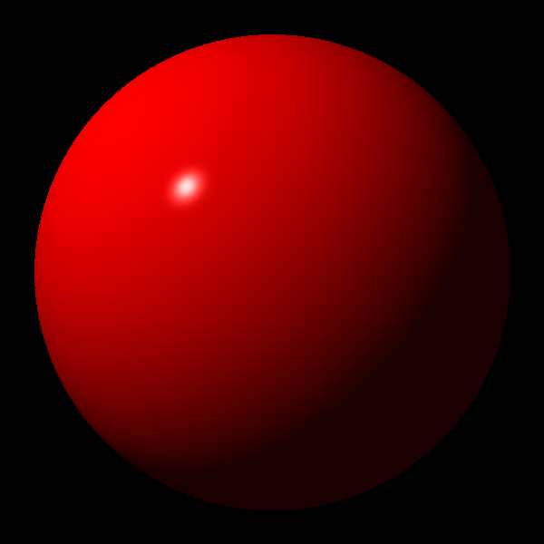
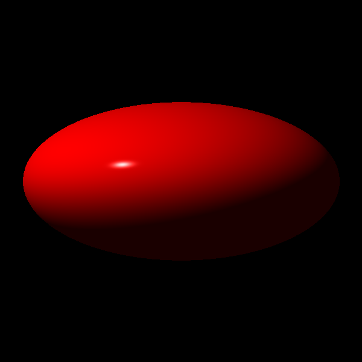
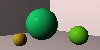
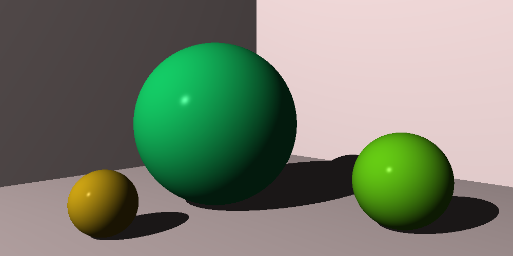
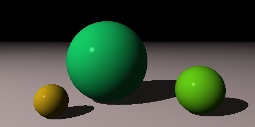

# The Ray Tracer Challenge

Test-driven development of a ray tracer based on the book by Jamis Buck.

## Roadmap

*First sphere:*

  
  

*First world:*

  
  

*Finally added shadows:*

*Implemented plane:*

